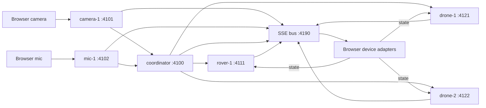

# Local Edge message flow

Six `expanso-edge` processes run six pipeline jobs on the laptop. The coordinator's Bloblang processors and memory cache own the destination, confidence gate, pending go, and stop window. The Python launcher starts processes, serves `web/`, and transports envelopes over SSE.



All addresses bind to `127.0.0.1`. Recognition and state nodes also forward their accepted envelopes to the coordinator. Incoming actuator commands terminate at their device node after publication, preventing a routing loop. Actuator state is visible on the bus; it does not change the five coordination rules.

| Node | Envelope endpoint | Management API |
|---|---|---|
| coordinator | `4100/events` | `4200` |
| camera-1 | `4101/events` | `4201` |
| mic-1 | `4102/events` | `4202` |
| rover-1 | `4111/events` | `4203` |
| drone-1 | `4121/events` | `4204` |
| drone-2 | `4122/events` | `4205` |

The presenter uses `http://127.0.0.1:4180/`. Its single EventSource connection reads `http://127.0.0.1:4190/stream`. Device modules POST JSON envelopes with **Content-Type: text/plain**. This is a simple CORS request; Edge parses the body as JSON regardless of the header. The allowed browser origin is exactly `http://127.0.0.1:4180`. Edge v2.1.21 does not accept the newer `cors.allowed_headers` or `cors.allowed_methods` fields, and its JSON-content-type preflight fails. Do not change browser POSTs to `application/json`.

## Coordination

`pipelines/coordinate.blobl` runs with one processing thread and a non-expiring in-memory cache. A 50 ms generator supplies internal ticks; those ticks never leave the coordinator. Device timestamps remain in the envelopes for display. Stop-window timing uses the coordinator's processing clock, so an incorrect client timestamp cannot bypass the window.

| Input | Decision and commands |
|---|---|
| Confident new card | Store station 1 or 2, become ready, send hold to all three adapters. |
| Repeated confident card | Keep the current phase and pending go. |
| Low confidence or unreadable input | Become uncertain, explain why, cancel pending go, send hold. Keep the destination. |
| Go with no destination | Become ready with `no destination yet`. |
| Go with a clear destination | Wait 1.5 seconds, then become moving and send move_to to all three devices. |
| Stop | Become paused immediately, cancel pending go, send pause to every device. Keep the destination. |
| Go within 1.5 seconds after stop | Stay paused; stop wins. |
| Later go | After its stop window, send move_to toward the retained destination. |

A stop received during a pending go cancels that go before any move command is emitted. A later go resumes through `move_to` with the kept station, which fits the adapter contract. After uncertainty, a confident card clears the confidence gate. A new station requires a new go. The threshold defaults to 0.80 and is configurable at launch.

## Envelopes and bus

Each node validates its allowed source, kind, body fields, UUID, UTC timestamp, confidence or coordinates, and raw-byte count. Unknown fields and envelopes of 1 KB or more are filtered before forwarding. Filtered input currently receives HTTP 200 with no bus event; success of the HTTP request alone is not proof of recognition acceptance.

The bus assigns increasing SSE IDs under a lock, establishing a total order of accepted publications. Recognition appears before its derived decision; the coordinator sends each decision before its three commands. Commands appear once, when the target node accepts them. Browser adapters subscribe to their target's commands and POST state to their own device node. The bus never calls an adapter or changes a decision.

The in-memory replay buffer retains the most recent 10,000 envelopes. `Last-Event-ID` resumes from that cursor; an exceeded cursor produces a named `gap` event. A new connection receives the retained history. Consumers should deduplicate replayed IDs before applying commands. Restarting the launcher clears the bus and coordination state. This stage transport is not a durable event log or a hardware safety controller.

## Run and verify

Install `expanso-edge` and `uv` before going offline. The launcher fetches no packages, models, or credentials at runtime.

```sh
scripts/run
```

The launcher prints the URL after all six jobs listen. It starts with fresh project-local execution state and no selected destination. Ctrl-C stops its children and servers. Another terminal can run:

```sh
scripts/stop
```

To change the confidence threshold:

```sh
CONFIDENCE_THRESHOLD=0.90 scripts/run
```

Run fixtures with no demo already listening:

```sh
uv run --offline --no-project tests/pipelines/run.py
```

After editing either Bloblang file or the pipeline renderer, regenerate the checked-in job files and validate them:

```sh
uv run --offline --no-project scripts/build-pipelines.py
CONFIDENCE_THRESHOLD=0.80 expanso-edge validate pipelines/*.yaml
```

The `.yaml` files use JSON syntax, which is valid YAML. The renderer wires documented Edge components and embeds the Bloblang rules; it contains no second rule implementation.

Each run stores identities, execution state, and logs under ignored `.runtime/`, with owner-only permissions. Local mode needs no credentials or global CLI profile. The launcher clears inherited `EXPANSO_*` settings and supplies explicit local config, data directories, names, and API bindings. It submits jobs directly to the local management API, avoiding global CLI profile loading.

## Verified component references

Commands were checked against installed `expanso-edge run --help` and `expanso-edge validate --help`. Pipeline fields were checked against `~/.expanso-docs/llm.txt`: `http_server`, `broker`, `generate`, `branch`, `http`, `cache`, `memory`, `mapping`, `unarchive`, `split`, and `http_client`, plus Bloblang function and method references.

The local-mode page documents POST job submission, but v2.1.21 returns 404 for that method. The current Edge router and Go client use `PUT /api/v1/jobs` with a JSON `spec` wrapper. The launcher uses that verified API. The [dated proof](proof/2026-10-06-pipelines.md) records execution and browser results.
